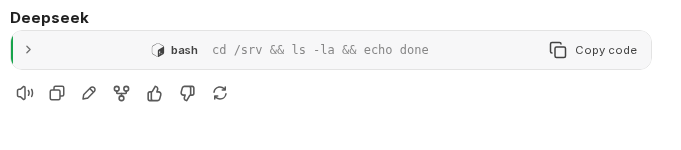
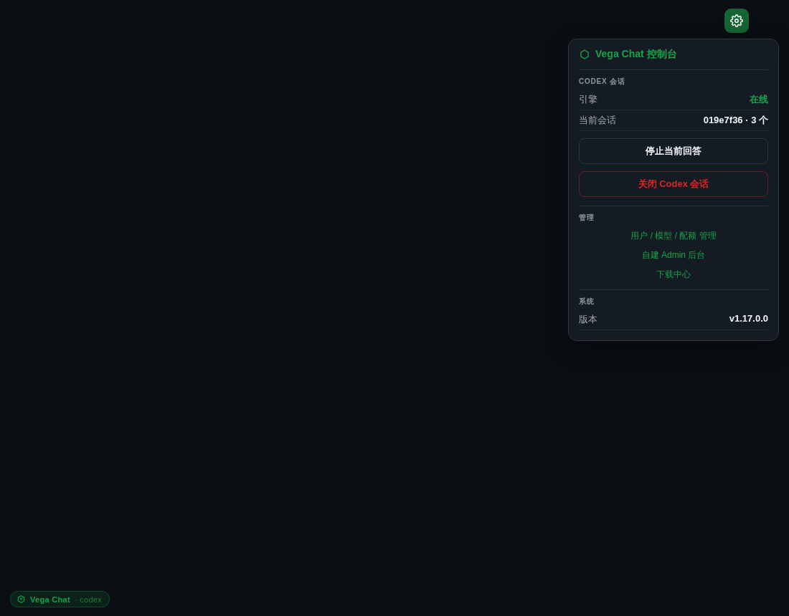
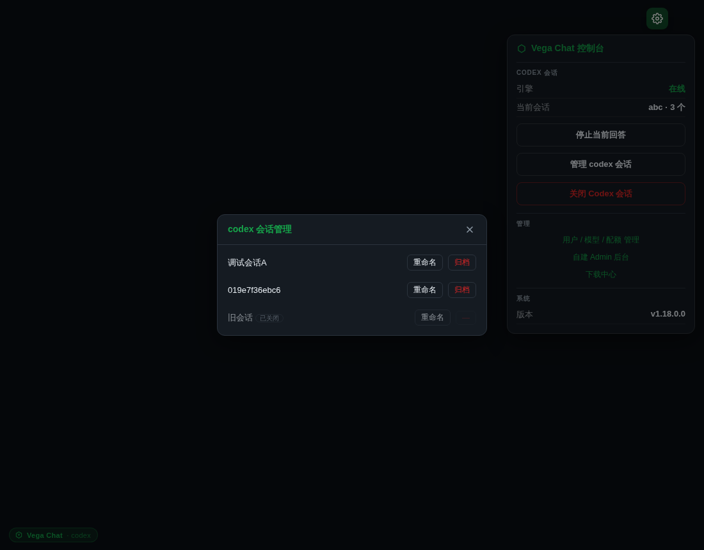

<div align="center">

# ⬡ Vega Chat

**一个把 OpenAI Codex 深度焊进聊天界面的多模型 AI 工作台**

基于 [LibreChat](https://github.com/danny-avila/LibreChat) 内核，叠加长驻 codex 引擎、
专业级 codex 交互体验与一键自部署 —— 不是补丁，是一体化的差异产品。

[](./LICENSE)
[](https://www.python.org/)
[](https://docs.docker.com/compose/)
[](https://github.com/danny-avila/LibreChat)
[](https://github.com/openai/codex)
[](https://github.com/FruityMaxine/vega-chat/stargazers)
[](https://github.com/FruityMaxine/vega-chat/commits/main)
[](https://github.com/FruityMaxine/vega-chat/issues)

</div>

---

## 这是什么

**Vega Chat** 把 OpenAI 的 `codex` CLI 通过其 **app-server（JSON-RPC over stdio）协议**包成
OpenAI 兼容端点，作为一个一等公民模型接进聊天界面 —— 你能像和模型聊天一样直接驱动 codex，
让它在服务器上真实执行文件操作 / 命令 / 构建，并以**为 codex 量身定制的 UI** 呈现结果。

> 普通方案是"在 LibreChat 上打几个补丁"。Vega Chat 的目标是让 codex 用起来像专业 IDE，
> 并把整套东西做成可一键部署、可开源分发的**独立项目**。

## 差异化卖点

| 能力 | 说明 |
|---|---|
| **长驻 codex app-server 集成** | 单进程长驻 JSON-RPC，无上限 NDJSON 行缓冲，根治超长输出中断；多用户会话 SQLite 隔离 |
| **命令/工具输出折叠** | bash/console 输出**默认折叠**、点击展开，折叠头显示命令预览 + 行数 —— 不再一坨刷屏 |
| **token 用量 chip** | 消息尾 token 做成样式化 chip（入/出/缓存/命中率），非裸文本 |
| **codex 会话管理器** | 列出 codex 会话、重命名打标签、归档/恢复 —— 像 IDE 管理工作区 |
| **统一品牌 hub** | 右上角齿轮一个入口通会话控制 / 用户模型配额管理 / 系统状态，去散装感 |
| **一键部署 + codex 自动接入** | `./scripts/setup.sh` 全栈起服 + `./scripts/codex-onboard.sh` 幂等接 codex |
| **健壮性内功** | resume 自愈 / abort / 空闲超时 / schema 漂移容错（防 codex 升级静默崩） |

## 与同类方案对比

|  | **Vega Chat** | 原生 LibreChat + codex 补丁 | codex-mobile 类 Web 包装 |
|---|---|---|---|
| codex 接入 | app-server JSON-RPC 长驻进程 | 多为 `exec` 单次调用 / 裸 stdout | Web 包一层 codex CLI |
| 超长输出中断 | **根治**（无上限 NDJSON 行缓冲） | 易触发 asyncio 行长上限而断流 | 取决于实现，常见断流 |
| 命令 / 工具输出 | **默认折叠** + 命令预览 + 行数 | 原文一坨刷屏 | 原文输出 |
| token 用量 | 样式化 chip（入/出/缓存/命中率） | 裸文本或无 | 无 |
| 会话关闭 / 重命名 | **会话管理器**（列表/标签/归档） | 无对应入口 | 一般无 |
| 多用户隔离 | SQLite 复合主键，治串台 | 取决于补丁 | 单用户为主 |
| 多模型能力 | **保留 LibreChat 全部** | 保留 | 仅 codex |
| 部署 | 一键 `setup.sh` + 幂等 `codex-onboard.sh` | 手工拼 | 各自为政 |

> 不是"在 LibreChat 上再打几个补丁"，而是把 codex 的交互体验做到 IDE 级，
> 同时不牺牲 LibreChat 原有的多模型工作台能力。

## 架构

```
                          浏览器 (你)
                              │  HTTPS
                       ┌──────▼──────┐
                       │    Caddy     │  反代 + TLS
                       └──┬───────┬───┘
          /vega-admin/*   │       │   /  (聊天)
                ┌─────────▼──┐ ┌──▼────────────────┐
                │ vega-admin │ │  LibreChat 内核     │  ← 预构建镜像
                │ (FastAPI)  │ │  (React + Node)    │
                │ inject.js  │ └──┬─────────────────┘
                │ 注入聊天页 │    │ host.docker.internal:3084
                └────────────┘ ┌──▼─────────────────┐
                               │ vega-codex-proxy    │  ← 核心差异
                               │ codex app-server    │
                               │ 长驻 JSON-RPC 客户端 │
                               └──┬──────────┬───────┘
                          codex app-server   │ SQLite
                          (stdio JSON-RPC)   session_store
                                             (多用户隔离/会话标签)
```

- **vega-codex-proxy**（Python/FastAPI）：把 `codex app-server` 包成 OpenAI 兼容 `/v1/*` 端点，
  归一化事件、管理会话、暴露 `/codex/session/*` 控制端点。
- **vega-admin**（Python/FastAPI）：服务 `inject.js`（注入聊天页做折叠/chip/hub）+ 管理 API 转发。
- **inject.js**：MutationObserver 驱动的前端增强层（折叠 / token chip / 品牌主题 / 会话管理器），
  注入预构建的 LibreChat 页面 —— 不 fork React 源码。

详见 [docs/ARCHITECTURE.md](./docs/ARCHITECTURE.md)。

## 快速部署

```bash
git clone https://github.com/FruityMaxine/vega-chat.git
cd vega-chat
cp docker/.env.example docker/.env && $EDITOR docker/.env   # 填密钥
./scripts/setup.sh          # docker 全栈 + venv + systemd + 健康校验
./scripts/codex-onboard.sh  # 接入 codex (幂等)
```

完整步骤与故障排查见 [docs/DEPLOY.md](./docs/DEPLOY.md)。

## 截图

| 命令默认折叠（点击展开） | token 用量 chip |
|---|---|
|  |  |

| 统一品牌 hub | codex 会话管理器 |
|---|---|
|  |  |

## 技术栈

Python · FastAPI · SQLite · Docker Compose · Caddy · 原生 JS 注入层 ·
[LibreChat](https://github.com/danny-avila/LibreChat) 内核 · [codex](https://github.com/openai/codex) app-server

## Roadmap

- [ ] codex 会话按项目 / 工作目录分组
- [ ] 折叠块语法高亮（diff / 多语言）
- [ ] token chip 历史成本累计与可视化
- [ ] approval 策略可视化配置（命令白名单 / 工作目录围栏）
- [ ] 一键 `docker compose` 全栈（含 vega-codex-proxy 容器化，去 systemd 依赖）
- [ ] 英文文档与 i18n

欢迎在 [issues](https://github.com/FruityMaxine/vega-chat/issues) 提建议（注意非商用 license）。

## License

**[PolyForm Noncommercial 1.0.0](./LICENSE)** — 允许个人 / 研究 / 非营利使用，**禁止商用**。
商用须另行获得授权。第三方组件归属见 [THIRD_PARTY.md](./THIRD_PARTY.md)。

Copyright © 2026 FruityMaxine.
